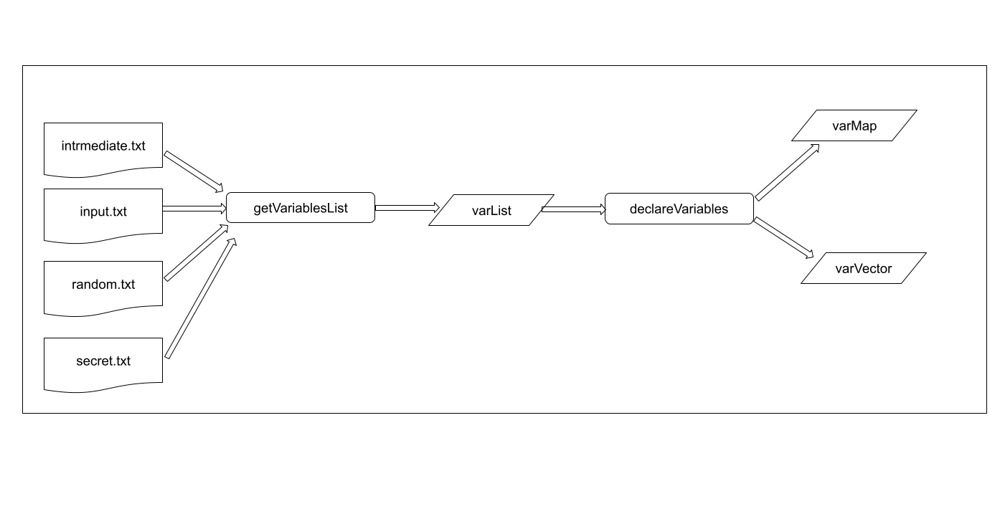
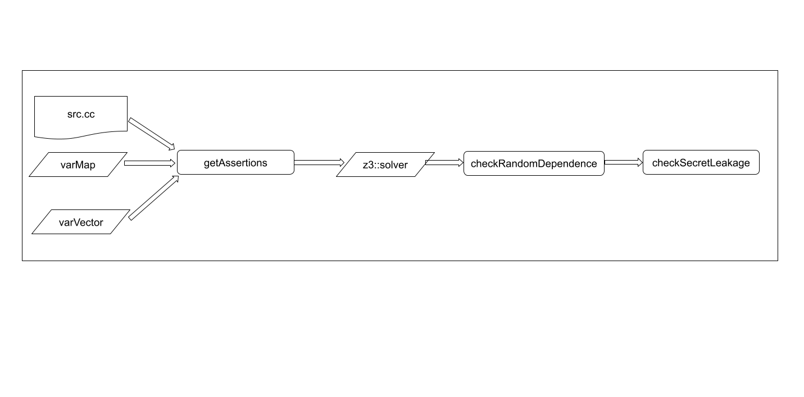

How to execute:
```console
user@system:~$ g++ -o main main.cc getVariables.cc getAssertions.cc -lz3
user@system:~$ ./main
```

Program flow:



> {list.txt} -> [getVariablesList] -> {varList} -> [declareVariables] -> {varVector_0, varMap_0, varVector_1, varMap_1}

> {prog.cc, varVector_0, varMap_0, varVector_1, varMap_1} -> [getAssertions] -> {solver (with added assertions)}

Functions:
```
- getVariables.cc
  - getVariablesList
  - getArrayDetails
  - getVariableType
  - declareVariables
  - declareConstants

- getAssertions.cc
  - isExpression
  - hasOperator
  - getExpression
  - addAssertions

- randomDependence.cc
  - checkRandomDependence
  ```

To-Do:
- [x] Design program flow and data structures
- [x] Extract variables and variable types from input list
- [x] Declare corresponding z3 variables/constants
- [x] Finish getExpression function 
- [x] Babysteps to addAssertion function 
- [x] Rewrite inputProg in 3-OP unrolled form
- [x] Add assertions for all operation stmts
- [x] Refactor addAssertions and declareVariables for bv_0,_1 idea
- [x] Debug and finish addAssertions
- [x] Try randomDependenceCheck idea
- [ ] Debug, refactor and finish randomDependence
- [ ] Get non-dependent list, and start secretLeakageCheck